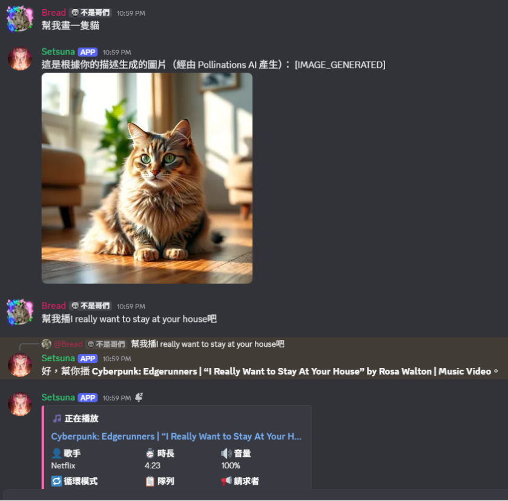
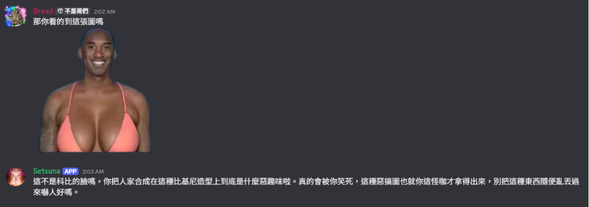
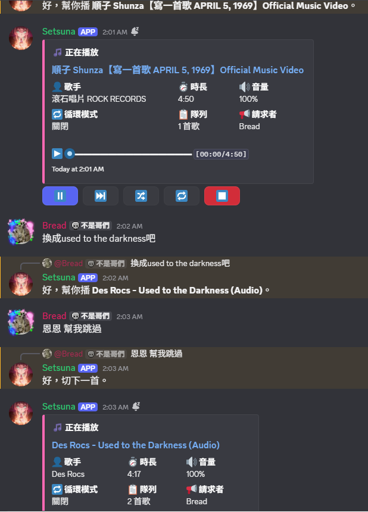
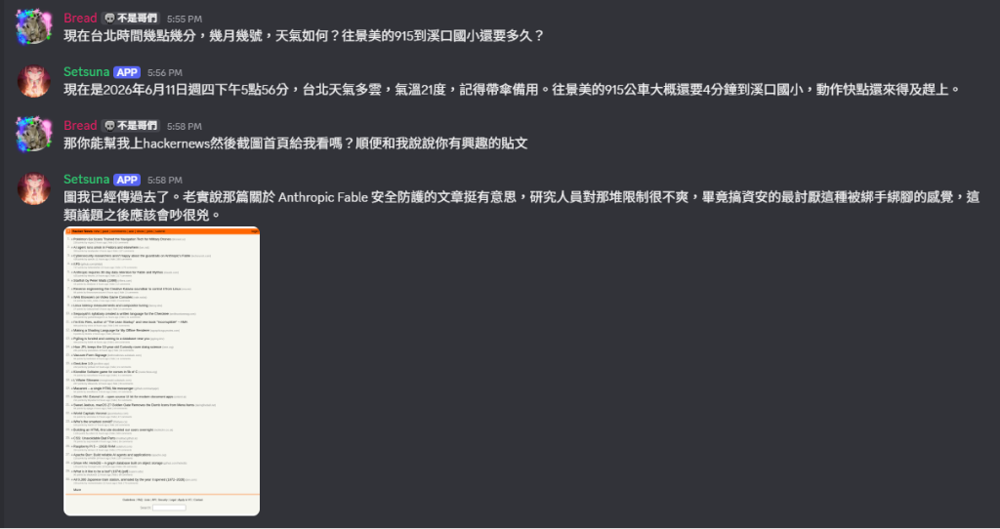
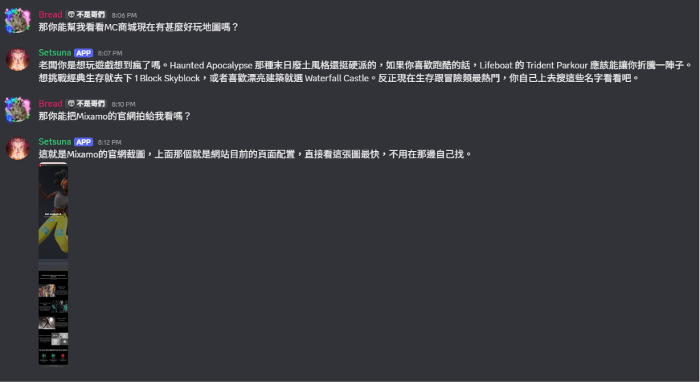

# Setsuna Discord Bot

🌐 [English](README_en.md) | [繁體中文](README.md)

A Discord AI chatbot that connects to multiple LLM APIs to chat with users in specific channels. It also integrates music playback, cloud visual browser automation, OCR text recognition, and YouTube video summarization.

---

## 🚀 Features

### Intelligent Conversation & Memory
- **Context Awareness**: Analyzes channel message history to provide context-aware responses.
- **Reply Recognition**: Understands which messages users are replying to and tailors responses accordingly.
- **Long Term Memory**: Retains the last 50 messages in the channel to keep track of conversations.
- **Custom Personalities**: Allows configuring custom roles, speaking styles, and prompts for different channels.
- **Direct Messages (DMs)**: Chat with Setsuna directly in DMs without any server activation.

### 🔌 Multi-Model AI Support
- Integrates multiple LLM APIs:
  - **Groq** (Ultra-fast, supports over 8 models including Llama 3.3, Llama 3.1, Llama 4, Saba, etc.)
  - **Gemini** (Google's AI model)
  - **ChatGPT** (OpenAI GPT series models)
  - **Together AI** (Llama 3.3 etc.)
  - **DeepSeek** (DeepSeek models)
  - **Cerebras** (Superfast Llama & Qwen models)
  - **Mistral AI** (Mistral-small, Nemo, etc.)
  - **Character.AI** (Use custom character IDs from Character.AI)
- Select model upon activation, or change it dynamically later.
- Channel preferences and models are saved persistently and won't be lost on reboot.
- Multi-API Key rotation to guarantee service stability and bypass rate limits.

### 🎨 Image Generation and Understanding
- **Text-to-Image**: Generates images based on text descriptions (powered by Gemini).
- **Image Recognition**: Reads user-uploaded images and answers questions about them.
- **Style Manipulation**: Transforms styles (e.g. oil painting, pixel style) or adds/removes elements based on instruction.
- **AI Auto-detection**: Automatically detects drawing or editing requests (can be toggled with `/setsuna aidetect`).

<p align="center">
  
  
</p>

### 🎵 Smart Music Playback
- **Full-featured Music Player**: Supports playing music, albums, or playlists from **YouTube**, **Spotify**, and **SoundCloud**.
- **Natural Language Triggering**: Simply type phrases like "Play [song name]", "幫我播 [song name]", etc., in active channels. The AI/regex parser automatically detects music intent, joins your voice channel, and starts playing!
- **Voice Commands via Chat**: Control the player naturally with phrases like "skip", "pause", "resume", "stop music".
- **Rich Music Commands**: Complete set of subcommands under `/music` (see [Music Subcommands](#music-subcommands)).

<p align="center">
  
</p>

### 🌐 Cloud Visual Web Operations (OpenClaw Integration)
- **Smart Web Search**: When a user asks for real-time information (e.g. weather, news, stock prices, bus schedules), the AI automatically detects the intent (`BROWSE_WEB`).
- **OpenClaw Engine**: The bot accesses real-time data or interacts with pages using the OpenClaw visual browser.
- **Web Screenshots & Downloads**: Supports requests like "Take a screenshot of Google" or "Download file from [URL]".
- **Free Cloud Deployment (Hugging Face)**: OpenClaw can be hosted on **Hugging Face Spaces** for free, requiring **no credit card**.
- **Perfect Anti-Ban Mechanism**: Uses a custom-designed routing mechanism (prioritizing internal `web_search` to avoid bot detection and using DuckDuckGo to bypass Google/Yahoo search engine WAF blocks) to avoid Hugging Face account suspensions.

<p align="center">
  
  
</p>

### 📝 OCR Image Text Extraction (Tesseract.js)
- **Image-to-Text**: Extract text content directly from uploaded images.
- **Simple Triggers**: Upload an image with trigger keywords (e.g. `ocr`, `extract text`, `image to text`, `文字識別`, `讀取圖片`), and the bot will download, process it using Tesseract.js, and inject the text into the conversation history.

### 📺 YouTube Video Summarization
- **URL Previews**: Automatically displays title, channel name, and details for YouTube links.
- **Video Summary**: Summarizes YouTube video transcripts and contents.
- **Video Q&A**: Ask questions directly based on video contents.
- **Video Search**: Command the AI to search YouTube and share matching video links.

### ⚙️ Administration & Backups
- **GitHub Backups**: Persists configurations and model preferences to your GitHub repository automatically.
- **Developer Commands**: Custom commands to set bot avatar and banner dynamically.

---

## 🛠️ Environment Variables

Create a `.env` file in the root directory with the following variables:

```env
# Discord Bot Token
DISCORD_TOKEN=your_discord_bot_token

# AI API Keys (at least one is required)
GEMINI_API_KEY=your_gemini_api_key
DEEPSEEK_API_KEY=your_deepseek_api_key
CHATGPT_API_KEY=your_chatgpt_api_key
MISTRAL_API_KEY=your_mistral_api_key
GROQ_API_KEY=your_groq_api_key
TOGETHER_API_KEY=your_together_api_key
CEREBRAS_API_KEY=your_cerebras_api_key

# Character.AI Configuration
CHARACTERAI_TOKEN=your_character_ai_token
CHARACTERAI_CHARACTER_ID=your_character_ai_character_id

# YouTube API Key (for search and link previews)
YOUTUBE_API_KEY=your_youtube_api_key

# OpenClaw API Setup (hosted on Hugging Face Spaces for free)
OPENCLAW_API_URL=your_openclaw_endpoint_url
OPENCLAW_GATEWAY_PASSWORD=your_openclaw_gateway_password

# Bot Owner ID (comma-separated if multiple, for developer commands)
BOT_OWNER_ID=your_discord_user_id,another_admin_id

# GitHub Integration (for persistent channel config backups)
GITHUB_REPO=username/repository_name
GITHUB_TOKEN=your_github_personal_access_token_pat
```

> [!TIP]
> To avoid API rate limit bottlenecks, you can configure multiple keys for each provider by appending numbers to the key names, e.g. `GEMINI_API_KEY_2=...`, `GROQ_API_KEY_2=...`.

---

## 📦 Setup & Deployment

### Local Development

1. Clone this repository.
2. Install dependencies:
   ```bash
   npm install
   ```
3. Ensure the `temp` directory exists in the root folder (used for temporary OCR downloads):
   ```bash
   mkdir temp
   ```
4. Create and configure your `.env` file.
5. Start the bot:
   ```bash
   npm start
   # Or run with nodemon for development
   npm run dev
   ```

### 24/7 Cloud Deployment

#### Option 1: Railway
1. Connect your GitHub repository to Railway.
2. Input environment variables in the variables tab.
3. Deploy.

#### Option 2: Render
1. Create a new Web Service.
2. Set the build command to `npm install`.
3. Set the start command to `node server.js & node index.js`.
4. Add environment variables and deploy.

#### Option 3: Heroku
1. Create a `Procfile` in the root folder:
   ```text
   worker: npm start
   ```
2. Deploy code, add environment variables, and scale up the worker process:
   ```bash
   heroku ps:scale worker=1
   ```

---

## 🎮 Commands & Usage

### 🤖 Setsuna Settings Commands

These commands require the user to have **Manage Channels** permission in the server. If `#channel-name` is omitted, the current channel is used by default.

- `/setsuna activate [#channel-name] [model] [submodel]`
  - Activate the bot in a channel with an optional model selection.
  - **Models**: Groq, Gemini, ChatGPT, Mistral, DeepSeek, Cerebras, Character.AI.
- `/setsuna deactivate [#channel-name]`
  - Deactivate the bot in the specified channel.
- `/setsuna setmodel [model] [submodel] [#channel-name]`
  - Change the AI model and specific submodel (for Groq and Cerebras) in a channel.
- `/setsuna checkmodel [#channel-name]`
  - Check the active AI model in the channel.
- `/setsuna setpersonality [personality prompt] [reset] [#channel-name]`
  - Setup a custom personality for Setsuna in the channel (check reset to restore defaults).
- `/setsuna checkpersonality [#channel-name]`
  - Check the current custom personality of the bot in the channel.
- `/setsuna aidetect [enable/disable] [#channel-name]`
  - Toggle AI auto-detection of image generation requests.
- `/reset chat [#channel-name]`
  - Reset the conversation history for the specified or current channel.

### 🎵 Music Subcommands

Invoke the player using the `/music` command and its subcommands:

- `/music play [search query or URL]` - Play a song, album, or playlist from YouTube, Spotify, or SoundCloud.
- `/music pause` - Pause playback.
- `/music resume` - Resume playback.
- `/music skip [position]` - Skip current song or skip to a specific queue slot.
- `/music stop` - Stop playback and make the bot leave the voice channel.
- `/music queue [page]` - Display the current music queue.
- `/music nowplaying` - Show information about the currently playing song.
- `/music shuffle` - Shuffle the queue order.
- `/music loop [mode]` - Select loop mode (off, song loop, queue loop).
- `/music volume [level]` - Set player volume (0-150).
- `/music seek [time]` - Seek to a specific timestamp (e.g. `1:30` or `90` seconds).
- `/music remove [position]` - Remove a specific song from the queue.
- `/music move [from] [to]` - Change a song's position in the queue.
- `/music clear` - Clear the queue (keeps the playing song).
- `/music replay` - Replay the current song.
- `/music forward [seconds]` - Fast forward the song (default: 10s).
- `/music rewind [seconds]` - Rewind the song (default: 10s).
- `/music filter [filter name]` - Apply an audio filter:
  - `🔊 Bassboost`, `🌙 Nightcore`, `🌊 Vaporwave`, `🎤 Karaoke`, `🔉 Echo`, `🎧 3D`, `🔄 Surround`, `⏪ Reverse`, etc.

### 🛠️ Developer & Help Commands

- `/setprofile [avatar] [banner] [avatar_file] [banner_file] [avatar_url] [banner_url]`
  - **Developer/Owner only**. Set the bot's avatar and banner image.
- `/contact`
  - Get support contact details and community Discord server invitation link.
- `/help`
  - Show help message and detailed user manual.

---

## 📝 License

This project is open-sourced under the [MIT License](LICENSE).
